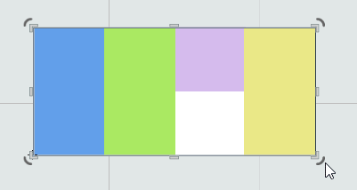

# Engine Architecture

The architecture is divided into three layers:

- **High-level**: scene, actors, components, UI, editor  
- **Low-level**: application wrapper, assets, rendering, animations, input, physics, scripting, sound  
- **Utility**: reflection and serialization, memory management, file system, debugging and logging, math, delegates, properties, data containers, timers  

The entry point is the application wrapper (`o2::Application`), which provides a cross-platform API for managing the application. It has platform-specific implementations for Windows, macOS, Linux, iOS, Android, and Emscripten (WIP). Some low-level and utility subsystems (rendering, file system, timers) also have platform-specific implementations. All subsystems are implemented as singletons for convenient access.

Before the application starts, certain utility systems (such as memory management and reflection) are statically initialized. Then, at startup, an instance of the application is created, which initializes the remaining subsystems, and after that the main game loop begins.

The game loop has two phases: update and rendering. Everything takes place inside `o2::Application::ProcessFrame`, where the input system, scene, physics, rendering, etc. are updated.

A developer can override the logic of `o2::Application` by inheriting a custom class and implementing the necessary functionality such as initialization, startup, rendering, updates, minimizing, and restoring the application.

## Memory Management [(detailed documentation)](/Docs/en/Architecture/Utils/memory.md)

The engine uses its own smart pointers with an external reference counter, but each object internally holds a reference to that counter. This allows converting a “raw” pointer into a smart pointer if the object inherits from `RefCounterable`, which stores a pointer to the counter. A strong reference `Ref<>` is used to manage object lifetime, while `WeakRef<>` does not affect it. Objects for these smart pointers are created only through the `mmake<T>(...)` function, which allocates a single memory block for both the counter and the object, ensuring the counter is always placed before the object (cache-friendly). In debug mode, the engine has a GC that points out potential memory leaks and cyclic references but does not destroy objects itself. It is only used for analysis. The editor includes a tool that displays the memory tree and highlights issues. In addition, there are specialized reference types for serializing unique identifiers: `AssetRef` (for assets) and `LinkRef` (for actors and components).

<details>
<summary>Example</summary>

```C++
class MyObject: public o2::RefCounterable 
{};

Ref<MyObject> myObjectSample = mmake<MyObject>(...);
myObjectSample->DoSmth();

WeakRef<MyObject> myWeakObject = WeakRef(myObjectSample);

MyObject* rawObject = myObjectSample.Get();
Ref<MyObject> myObjectSample2 = Ref(rawObject);
```
</details>

## Reflection [(detailed documentation)](/Docs/en/Architecture/Utils/reflection.md)

Reflection is used to access type structures at runtime (for finding animatable values by a string path, calling callbacks by name, serialization/deserialization, automatic script bindings). It relies on type metadata generated by the **o2CodeTool** utility. This tool parses header files (`.h`), finds C++ classes, analyzes their structure (including inheritance), locates `IObject` descendants, and generates type metadata at the end of the `.h` file. This metadata is stored in a shared repository and built incrementally: the code generator caches parsed files and updates only those that have changed.

<details>
<summary>Example</summary>

```C++
struct MyObject: public o2::IObject 
{
    float value = 0.0f;

    float DoSmth(float arg);

    IOBJECT(MyObject);
};

MyObject myObjectSample;
auto& type = TypeOf(MyObject);

assert(myObjectSample.GetType() == type);

float floatValue = type.GetField("value").GetValue(&myObjectSample);
float funcResult = type.Invoke<float>("DoSmth", &myObjectSample, floatValue);
```
</details>

## Serialization [(detailed documentation)](/Docs/en/Architecture/Utils/serialization.md)

JSON and a binary format (in development) are used for internal data storage. The `o2::DataValue` structure (similar to RapidJSON or PugiXML) stores arrays, tables, or simple values (numbers, strings, booleans, etc.). A `DataValue` can be loaded from a file and then converted into a C++ object, or vice versa — an object can be serialized into `o2::DataValue` and saved.

Serialization is performed via reflection, specifically the generated type metadata. A special object writes data to `o2::DataValue`. To be serialized, a class must implement the `o2::ISerializable` interface, and the fields to be serialized must be marked with the `@SERIALIZABLE` attribute. Only these types and fields are serialized, including primitives, containers, and smart pointers.

<details>
<summary>Example</summary>

```C++
class Reel : public ISerializable
{
public:
	LinkRef<Actor> imagesContainer; // @SERIALIZABLE

	Vector<AssetRef<ImageAsset>> images;        // @SERIALIZABLE
	Vector<AssetRef<ImageAsset>> blurredImages; // @SERIALIZABLE

	float imagesDistance = 100.0f; // @SERIALIZABLE

	bool disableExtendedSymbols = false; // @SERIALIZABLE

	SERIALIZABLE(Reel);
};
```
</details>

## Properties [(detailed documentation)](/Docs/en/Architecture/Utils/properties.md)

Properties allow declaring variables that use getter and setter “under the hood,” making the code more concise. Instead of `object.SetValue(object.GetValue() + 200.0f);`, you can write `object.value += 200.0f;`, similar to properties in C#.

To declare properties in a class, first use the `PROPERTIES(class_name)` macro. Then for each property, use the `PROPERTY(type, name, setter, getter)` macro, where `setter` and `getter` are class functions handling read and write operations.

<details>
<summary>Example</summary>

```C++
class MyObject
{
public:
	PROPERTIES(MyObject);
    PROPERTY(float, value, SetValue, GetValue);

public:
    void SetValue(float value);
    float GetValue() const;
};

MyObject object;

object.value = object.value + 100.0f; // object.SetValue(object.GetValue() + 100.0f);
```
</details>

## Delegates [(detailed documentation)](/Docs/en/Architecture/Utils/function.md)

`o2::Function<>` is an analog of `std::function<>` with extended functionality that allows storing multiple delegates simultaneously. This approach simplifies subscription and event systems. For example, in a button class, you can declare `o2::Function<void()> onClick;` and add several listeners to it.

<details>
<summary>Example</summary>

```C++
class MyButton
{
public:
	Function<void()> onClicked;

    ...
};

MyButton button;
button.onClicked += []() { ... };
button.onClicked += []() { ... };
button.onClicked += []() { ... };
```
</details>

## Application Wrapper [(detailed documentation)](/Docs/en/Architecture/LowLevel/application.md)

As mentioned above, this is the entry point and the main system of the engine. During initialization, it sets up the other subsystems. Then the game loop begins, processed in the `ProcessFrame()` function, where the scene, input, and all other subsystems are updated, and a frame is rendered. The application wrapper also handles system messages (activation, deactivation, etc.).

A user can hook into any of these points by overriding special functions in their custom application class.

<details>
<summary>Example</summary>

```C++
class MyApplication: public o2::Application
{
private:
    void OnUpdate(float dt) override;
    void OnDraw() override;
    void OnActivated() override;
    void OnDeactivated() override;
    void OnStarted() override;
    void OnClosing() override;
    void OnResizing() override;
};
```
</details>

## Assets [(detailed documentation)](/Docs/en/Architecture/LowLevel/assets.md)

The engine treats various resources (textures, sounds, text configs, etc.) as assets provided in raw form. For faster loading at runtime, they are pre-built: textures are packed into atlases and compressed, sounds are converted, and configs are turned into binary form.

Each asset has a unique `id` stored in a `.meta` file alongside the asset itself. That file may also contain compression info and other data not suitable for the original file. In addition, a tree of assets is built for efficient metadata loading.

Assets are processed by the **AssetsBuilder** tool, which detects changed resources and updates their built versions. It runs before the editor starts, during its operation, and when building the final release.

The engine provides the `o2::Assets` subsystem (a singleton) accessed from anywhere via the `o2Assets` macro. It loads the asset tree on startup and offers an easy interface to retrieve assets. Smart pointers `o2::AssetRef<>` are used; they serialize, cache the loading process, and automatically unload the asset when no references remain.

Assets can be individual files or “embedded” (instance). In the latter case, the asset is stored directly within a scene or a prefab.

<details>
<summary>Example</summary>

```C++
AssetRef<ImageAsset> image = o2Assets.GetAssetRef(id);
sprite.Load(image);
```
</details>

## Rendering [(detailed documentation)](/Docs/en/Architecture/LowLevel/render.md)

The rendering subsystem is available via the `o2Render` singleton. It can draw triangle meshes with materials (shaders, textures, parameters (WIP)) and uses batching: meshes with identical materials are combined and submitted to the render in a single call. It supports scissor test, stencil masks, and render targets.

Above the mesh rendering, there are abstractions: sprites, text, skinned meshes, particle effects, and Spine animations. They all implement `o2::IDrawable`; objects with rectangular dimensions also implement `o2::IRectDrawable`. The parameters of `o2::IRectDrawable` include position, size, rotation, scale, skew, or setting the transform via `o2::Basis`.

- **Sprites** support display modes: normal, 9-slice, tiled, progress filled. They have color, transparency, and are loaded from textures.
- **Text** works with both bitmap and vector fonts (via FreeType). CPU-based effects (shadow, outline, gradient, etc.) are available, along with formatting and alignment settings.
- **Particle systems** are single emitters with a set of effects. Rendering can be a regular sprite or a frame-by-frame animation. Emission parameters are adjustable, and in the editor, the effect can be rewound backward.

Rendering also includes camera support (`o2::Camera`), which sets the viewport in the engine’s logical rendering coordinates.

<details>
<summary>Example</summary>

```C++
AssetRef<ImageAsset> imageAsset = o2Assets.GetAssetRef(id);
auto sprite = mmake<Sprite>(imageAsset);
...
sprite->position = Vec2F(10, 10);
sprite->mode = SpriteMode::FixedAspect;
sprite->transparency = 0.5f;
...
sprite->Draw();
```
</details>

## Animations [(detailed documentation)](/Docs/en/Architecture/LowLevel/animations.md)

The engine has a built-in animation system and Spine integration. Spine animations are loaded from an asset, can be played, mixed, and have skins switched.

The built-in format is deeply integrated into the engine and can animate any field, including custom ones. The basic unit is **`o2::AnimationClip`**, which can be saved as an asset (`o2::AnimationAsset`). Clips consist of tracks, each animating one field identified by a string path (e.g., `"myStructure/myFolder/myParameter"`). Tracks contain key frames with a specific value and time.

To play a clip, use **`o2::AnimationPlayer`**: it takes an animation clip and a target object. By string paths, reflection finds the required fields. When the time updates, the player interpolates between key frames in the tracks, ensuring smooth animation at any framerate.

On the scene, there is an **`o2::AnimationComponent`** that can play multiple animations on an actor simultaneously and blend them by weights. It stores a list of states (clips) and switches among them.

Above it, there is **`o2::AnimationStateGraphComponent`** — a state machine for animations. It includes nodes (states) with several clips and transitions defining start time, duration, and easing functions. A developer specifies a target node, and the graph automatically finds a route, applying transitions and blending. This system works with both the built-in and Spine animations.

The editor has a special built-in animation editor. [More details](/Docs/en/Editor/Animation/animation.md).  
Animations can also be constructed from code via the **`o2::Animate`** interface.

<details>
<summary>Example</summary>

```C++
sample->SetHighlightAnimation(Animate(*sample->GetHighlightDrawable()).
                                      Hide().Scale(1.5f).Then().
                                      Wait(0.3f).Then().
                                      Show().Scale(1.0f).For(0.2f).Then().
                                      Wait(1.0f).Then().
                                      Hide().For(0.2f));
```
</details>

## Input Handling [(detailed documentation)](/Docs/en/Architecture/LowLevel/input.md)

The input system is accessed through the singleton `o2Events`. It provides basic handlers for system events (key presses, cursor position, etc.) and a higher-level logic (clicks, multi-touch). The high-level layer takes rendering scissor and element overlap into account.

For handling touch/click (hover, pressed, etc.), inherit from `o2::CursorAreaEventsListener` and implement the required methods (pressed, released, enter, exit, etc.). Two methods are mandatory:
1. Checking if a click is valid (for example, whether the cursor is inside the object bounds).
2. `OnDraw` — called during rendering to record the object’s order and current scissor state.

Afterwards, the input system automatically determines which object was clicked and calls the appropriate callbacks.

<details>
<summary>Example</summary>

```C++
class MyInteractiveObject: public o2::CursorAreaEventsListener
{
public:
    bool IsUnderPoint(const Vec2F& point) override { return _rectangle.IsInside(point); }

    void Draw()
    {
        sprite.Draw();

        o2::CursorAreaEventsListener::OnDrawn();
    }

private:
    void OnCursorPressed(const Input::Cursor& cursor) override { o2Debug.Log("Pressed!"); }
    void OnCursorReleased(const Input::Cursor& cursor) override { o2Debug.Log("Released!"); }
};
...
auto object = mmake<MyInteractiveObject>();
...
object.Draw();
```
</details>

## Scripting [(detailed documentation)](/Docs/en/Architecture/LowLevel/scripting.md)

The engine uses **JerryScript** — a compact and performant JavaScript runtime, which also allows using TypeScript if you want static typing.

On top of JerryScript, the engine has a wrapper accessible via the `o2Scripts` singleton and a JavaScript-value wrapper `o2::ScriptValue`.  
- `o2Scripts` can load and run scripts from files or strings and work with the global namespace via `o2::ScriptValue`.  
- `o2::ScriptValue` represents any JS variable (number, string, boolean, function, array, or object) and provides a convenient interface for handling these types, classes, and prototypes.

C++ type binding is done through reflection: at application startup, the engine registers the required classes in the global JavaScript runtime, using the generated type metadata.

<details>
<summary>Example</summary>

```C++
o2Scripts.GetGlobal().SetProperty("myValue", 256);
o2Scripts.Eval("print('myValue is ' + myValue)");
...
o2Scripts.Eval("let myObject = new MyObject");
auto myJSObject = o2Scripts.GetGlobal().GetProperty("myObject");
auto myProperty = myJSObject["propName"];
if (myProperty.GetValueType() == o2::ScriptValue::ValueType::Number)
{
    float myPropertyValue = myProperty.ToNumber();
    ...
}
```
</details>

## Physics [(detailed documentation)](/Docs/en/Architecture/LowLevel/physics.md)

The engine has Box2D integrated. When the application starts, it initializes the physics world, into which objects can be added via scene primitives. You can configure how the engine’s coordinate units scale to the physics world, solver precision, and collision between layers.

The base scene primitive is `o2::RigidBody`. It contains the physical parameters of the body and integrates it into the physics world. Colliders (`o2::ICollider`) such as `BoxCollider` or `CircleCollider` can be attached to it.

All physics configuration and management happens through the scene and editor.

## Sound (TBD)

Not yet implemented in the engine.

## Scene and Actors [(detailed documentation)](/Docs/en/Architecture/HighLevel/scene.md)

Above all subsystems is the scene system, accessed via the `o2Scene` singleton. It stores a list of actors (`o2::Actor`), which have components defining logic and rendering. Actors can belong to different types, such as `o2::Widget` (UI), `o2::RigidBody` (physics), or any user-defined class.

A scene can be saved and loaded from an asset, including incremental loading. Logically, there is only one scene instance (at least for now). The scene updates and renders itself automatically.

### Actors

Each actor (`o2::Actor`) has a transform, visibility and activity flags, plus child actors and components. Child actors inherit their parent’s transform and flags. If a parent actor moves, all its children move accordingly. The same applies to enabling or disabling them.

The engine provides basic actor types like sprites, animations, cameras, particles, UI, etc. A developer can inherit custom classes from `o2::Actor` and override the needed methods (`OnStart`, `OnEnabled/Disabled`, `OnDraw`, `OnUpdate`, etc.). This allows actors to represent specific entities (for instance, `o2::Button` inherits from `o2::Widget`, which inherits from `o2::Actor`).

### Components

Actors can contain a list of components that define their logic and rendering. To create a custom component, inherit from `o2::Component` and implement the required interface (`OnStart`, `OnEnabled/Disabled`, `OnDraw`, `OnUpdate`, etc.). This lets you compose logic: a single base actor can have multiple components.

### Prototypes

For faster and simpler development, the engine supports prototypes (similar to Unity’s prefabs). An actor can be saved as an asset and become a prototype, which can be inherited by other prototypes that modify the base. From one prototype, you can create many copies on the scene and then edit them.

This is especially useful for UI. You might have a base button prototype with specific graphics and logic, then derive several variations (green, blue, red). If you need to change the blue button’s color to purple, you only edit the prototype. Likewise, changes to the base button prototype propagate to all its inheritors.

### Scene Rendering

Scene rendering uses cameras and layers:
- The scene is divided into named layers, each with a specified rendering order.
- Cameras (at least one) are placed in the scene, each with its own transform and a list of layers to render.

Actors are assigned to layers and have a numerical priority defined in the actor itself. It can also inherit the layer and priority from its parent, so children render immediately after the parent and share its layer/priority. If inheritance is disabled, they render on their own layer based on the sorting order. By default, the scene is drawn according to the hierarchy, but you can manually adjust this using priorities and layers.

### Editor

There’s a built-in editor for editing scenes, prototypes, components, and assets. It includes various specialized tools (asset settings, log, parameters window, game window, scene hierarchy, scene editor, animation editor). [More on the editor](/Docs/en/Editor/editor.md).

## UI [(detailed documentation)](/Docs/en/Architecture/HighLevel/ui.md)

UI in the engine is part of the scene and follows its paradigm. The base UI element is `o2::Widget` (inheriting from `o2::Actor`), which overrides the actor logic:

- **Adaptive Layout**  
  The transform includes anchors for flexible positioning relative to the parent, enabling adaptive UI layout.  
  

- **Internal Widgets**  
  A widget can contain child controls that aren’t “full-fledged children” in the scene hierarchy, which is convenient for complex UI elements (e.g., a window with a header and a close button).

- **Layer System**  
  A widget holds layers (`o2::WidgetLayer`) that can have their own graphics (sprite, text, etc.), transform with anchors, nested layers, and names. Layers are a simplified analog of actors, easing rendering and preventing the scene hierarchy from becoming overloaded.

- **Animation States**  
  A widget can have multiple named states that can be turned on or off independently. Switching a state triggers an animation defined in code or in the editor (see the animation section).

### Layout Containers

For adaptive interfaces, there are special container widgets (`o2::HorizontalLayout`, `o2::VerticalLayout`, `o2::GridLayout`). They arrange their child elements according to the given rules, stretching/shrinking them or adjusting to their sizes.



### Built-in UI Widgets

The engine provides many basic UI controls: images, text, buttons, checkboxes, text fields, progress bars, scrollers, lists (regular or drop-down), trees, popups, windows, and so on.

Since the UI subsystem extends the scene system, UI elements can coexist with any game objects. The entire o2 editor is built on this UI system ([details in the Habr article](https://habr.com/ru/articles/521306/)).