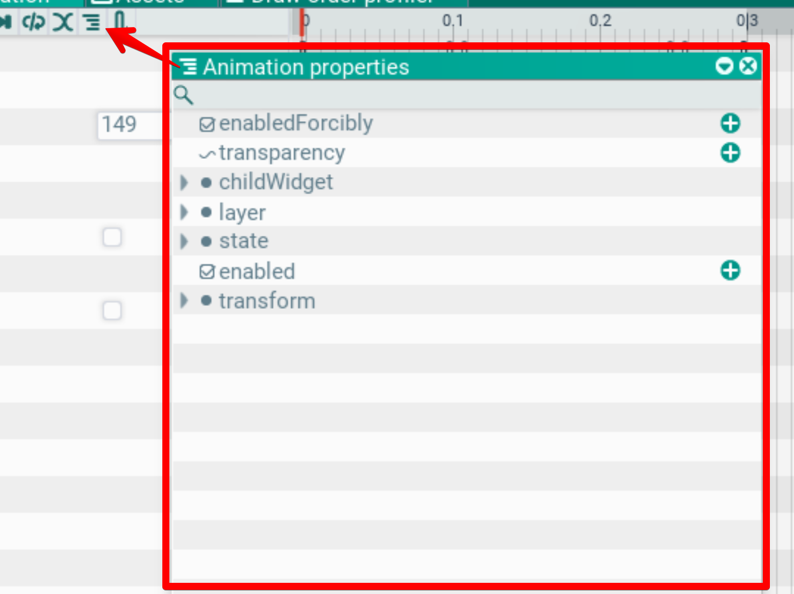
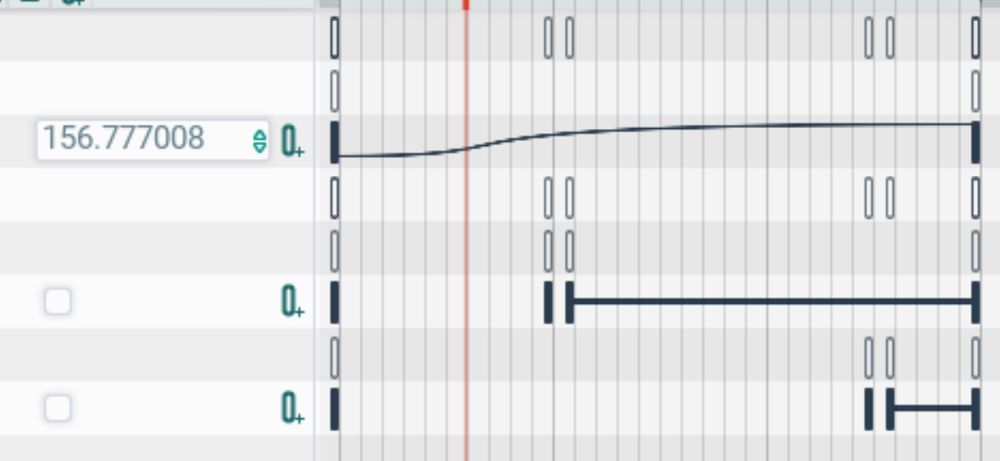
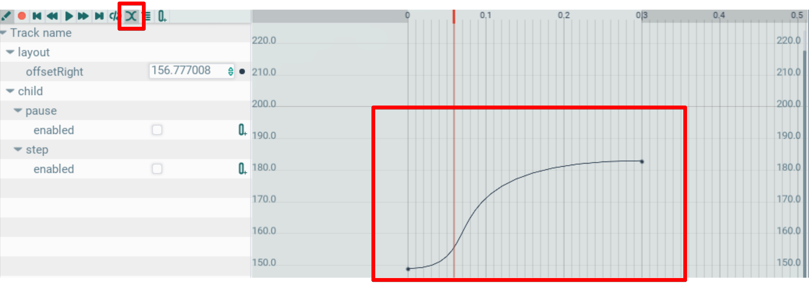

## Animation. Animation window

This window edits an animation asset. The functionality is similar to other animation editors, such as Spine.

The window has a toolbar with the typical functionality of such editors: record, rewind, play/stop, looping, curves mode, parameters list and key adding.

On the left the window shows the list of parameters, mirroring the scene hierarchy (4). On the right — keys on the timeline (3). Above the timeline — animation time controls (2). While an `AnimationComponent` state is previewed, the window drives the actor with its own player: the component's mixers for that state's tracks are suspended, so scrubbing is not overwritten by the state's values. Sub-track particle frames are baked on scrub frame by frame: for every frame the clip's value tracks are evaluated at that frame time, so the emitter sits where the clip puts the actor at that moment — world-space particles stay along the path, relative ones travel with the actor. A baked frame that does not match the current transform (edited trajectory) drops the cache, which is re-simulated with the same seed, so the particle pattern stays the same. Editing a sub-track emitter's parameters or effects rebakes the frame at the current cursor position right away — even if the emitter was left "playing" (play in the component header): a sub-controlled emitter never advances on its own, so that flag is ignored.

### Animation component
To add an animation to an actor, add the Animation component through the add-component menu.

The component holds a list of animations (1) that can play simultaneously.

If several animations animate the same parameters, a weighted average is computed based on Weight. This way several animations can be blended, producing smooth transitions between them.

Each animation references an animation asset (4). It can be picked from an existing asset or created in place.

To edit an animation, click the pencil icon (3) on the animation header.

### Animation parameters
To animate a parameter, it must be added to the animation. Click the button with stripes; a window with available parameters opens.

In this list the (+) and (-) buttons add or remove animated parameters. Anything shown in the Properties window can be animated.

### Keys and parameters
\
Each parameter has an edit field on the left. Keys, where the parameter is set explicitly, are marked with bars on the timeline. Between keys the value is interpolated according to the curve settings.

### Curve editing

Clicking the toolbar button shown on the screenshot switches the timeline into curves mode.

It shows curves for numeric parameters. They are bezier curves and are edited with the mouse, as in similar editors.

Zoom and scroll work as in the scene: right mouse button and wheel.
