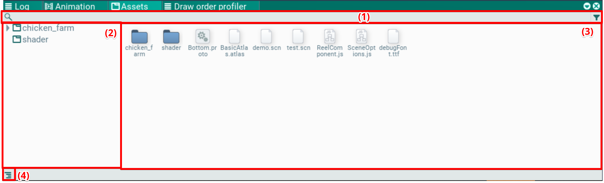
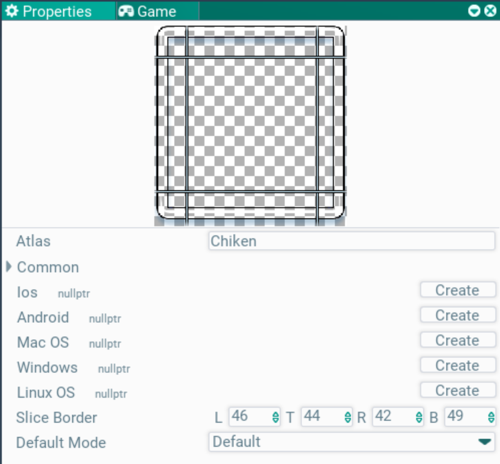
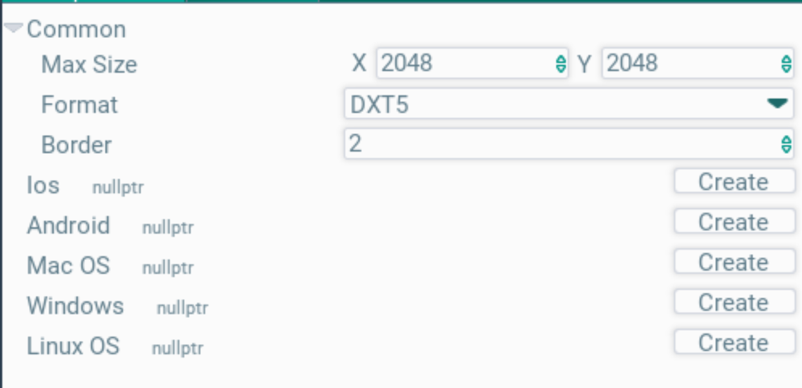

## Assets. Assets window

This window shows the assets of the game; they can be edited or dragged onto the scene.

The left side shows the folder hierarchy (2). Selecting a folder shows its assets in the files pane (3). The button (4) toggles the folder pane on and off.

At the top there is a filter for searching by name (1).

Assets and folders can be moved into folders via drag'n'drop. They can be copied, pasted and deleted. The functionality is much like a typical OS file browser.

New assets are created through the context menu, the Create item.

Clicking an asset selects it, and the Properties window shows its settings. There, for example, atlas and texture parameters and font styles can be changed.

Some asset types support drag'n'drop into the hierarchy or the scene: textures and prototypes. Just drag them to the desired place.

### Texture and atlas settings

Selecting an atlas or a texture allows editing its parameters; the settings appear in the Properties window. As soon as the file is deselected, it is saved automatically. It can also be saved with the Save button in the Properties window header.

When a texture is selected, its preview is shown, and the margins for a 9-slice sprite can be edited on top of it.

The Atlas field references the atlas the texture is packed into. To set the atlas, drag it into this field from the assets window.

When an atlas is selected, its parameters are shown in the Properties window as well.

It has common atlas settings (Common) and platform-specific ones (you likely don't need those). The common settings define the maximum atlas page size (an atlas may be packed into several pages), the compression format and the padding between textures when packing.
