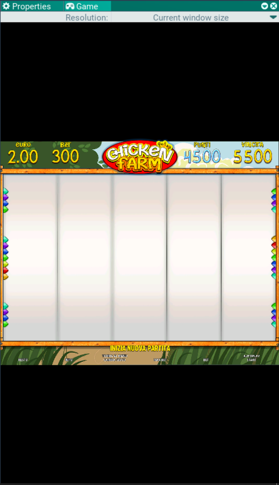

## Game. Game window

This window shows the game as if it were running as a standalone application. Rendering goes properly through the cameras. Mouse clicks are handled.

The panel at the top selects the emulated screen resolution.
