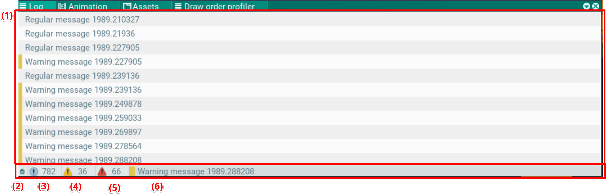

## Log. Log window

This window shows logs printed through the engine debug system. Logs are split by severity:
- regular
- warnings (yellow)
- errors (red)

They are listed in order of appearance (1).

Logs can be cleared (2), and display can be toggled per severity (3) (4) (5).

The bottom line shows the last log message (6).
