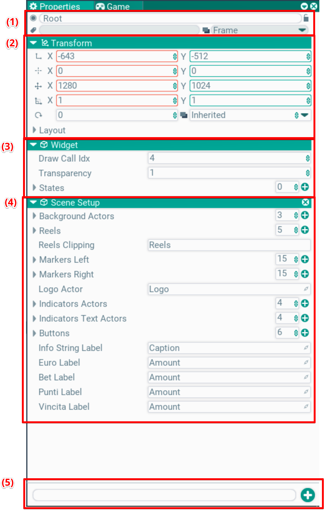

## Properties. Settings window

This window edits the selected entity. It may be an asset, some settings or an actor. The screenshot shows an example of an actor of the Widget type.

A notable feature is editing several selected entities at once. The editor then tries to show common fields and common values. If it finds nothing in common, or the values differ, nothing is shown or a dash is displayed instead of a value.

The editor can show many field types, including custom ones:
- numbers, strings, bool, enum
- arrays
- nested objects by value
- nested objects by pointer. Deletion and creation with type selection are available
- references to other actors. Assigned via drag'n'drop from the hierarchy
- references to assets. Assigned via drag'n'drop from the assets window, or created in place. In that case the asset is saved together with the actor.

### (1) Header
Shows the main actor info — enabled state (circle at the top left), name, tags, layer, lock. All these controls are editable.

### (2) Transform
Shows the local transform parameters of the selected actor:
- Position
- Pivot
- Size
- Scale
- Rotation and draw depth (Inherited — depth is inherited from the parent)
- Layout: dynamic layout settings for widgets

### (3) Actor settings
If the edited object is not a plain o2::Actor but a derived type, its parameters are shown. The screenshot example shows the transparency coefficient and the widget state list.

The settings are taken from the actor via reflection. All public fields are shown by default, plus fields marked with a special tag in code.

### (4) Components
Next, component parameters are shown block by block. Public fields declared in the component are shown the same way.

The cross button removes a component.

### (5) Add component menu
Clicking this menu expands it, showing the component tree. The input line filters by name. Double-click or Enter adds the selected component type to the selected actor.
