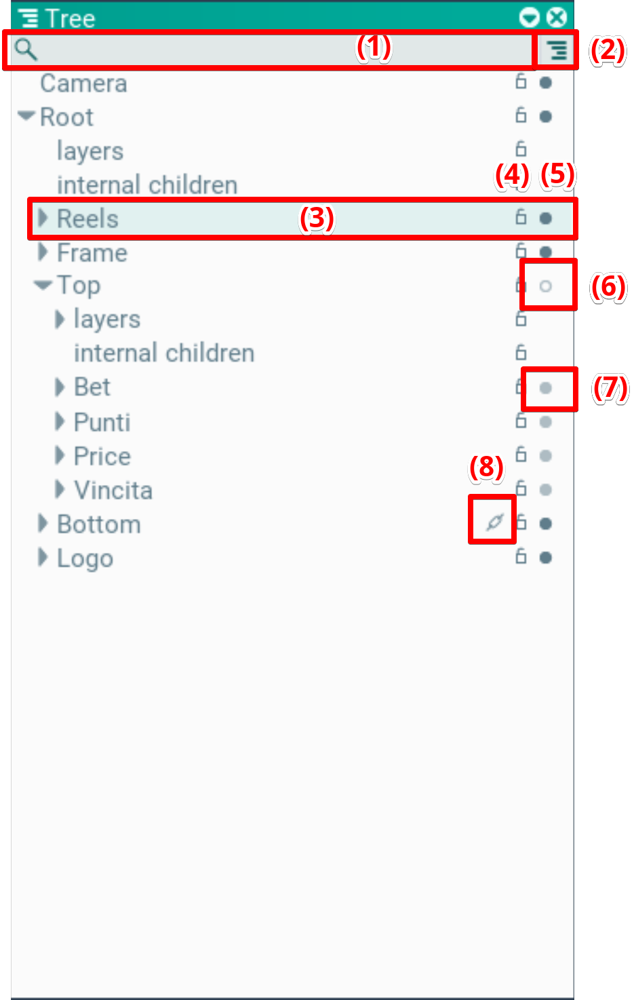
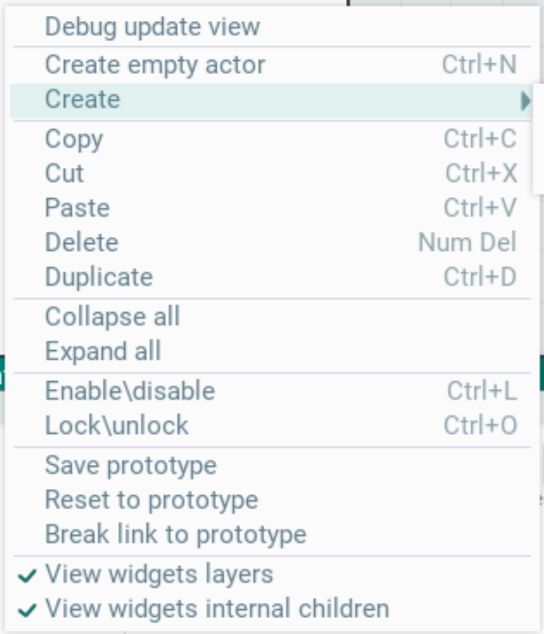
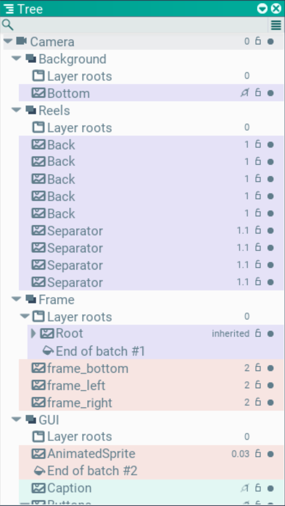

## Tree. Hierarchy window

The hierarchy window works in two modes: scene hierarchy and draw order. The modes are switched by the button (2).

### Scene mode:

The main part of the window is the scene hierarchy. Each row is an actor. At the top there is a filter by name (1).

Each actor row (3) shows its name, editable by double-click.

It also shows the enabled state (5). A bright filled circle — the node is enabled. An empty dim circle (6) — the node is disabled. A filled but dim circle (7) — the node itself is enabled, but since one of its parents is disabled, it counts as disabled.

Scene selection lock (4). It is sometimes useful to disable scene selection for parts of the hierarchy so they don't get in the way.

A chain link icon (8) may also be shown — it means the actor was created from a prototype. Clicking this icon highlights the prototype in the Assets window.

Actors can be moved via drag'n'drop. Press the mouse on the desired actor (or several) and start moving. Release the mouse over the target place.

Right-clicking opens the context menu. It lists hotkeys for the available actions. For them to work, the Tree or Scene window must be focused. When focused, the selected actors are highlighted in green, otherwise in gray.

The context menu creates new actors. Choose Create empty actor for an empty actor, or pick the desired type through the Create menu.

### Draw order mode

This mode shows the draw hierarchy and its order. The first level lists the cameras. In this example there is one — Camera.

Inside each camera there are layers, in draw order — Background, Reels, Frame, GUI.

Inside the layers there is a sorted list of drawn entities, with the priority at the end of the row. Layer roots is always shown with priority 0 — it is the container for objects that have no explicit numeric priority.

These entities may contain other entities if they inherit the draw priority from the parent.

Separate batches are marked with color; each ends with an End of batch #N row, where N is the batch number.

To change the draw order, move objects via drag'n'drop.
