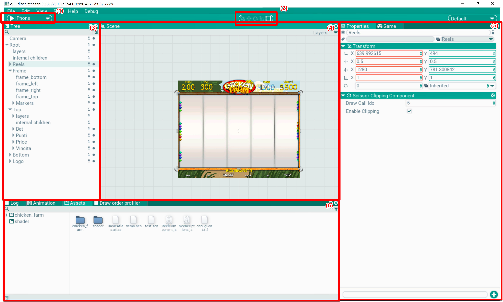

## Editor

The editor is where scenes are laid out and game content is created.

It contains internal windows that can be docked to each other and stacked into tabs. Windows can be moved, docked to other windows (drag by the window title) and grouped into tabs (double-click the title).

The editor works in two modes: editing and play. In edit mode the scene is loaded but does not receive updates, staying in a static state; it can be edited and saved. In play mode the scene can be tested: everything is shown in the editor, but the scene updates and input is processed in the game window. The scene cannot be saved in this mode.

Scene changes can be undone and redone: Edit/Undo (Ctrl+Z) and Edit/Redo (Ctrl+Y).

Windows and elements of the default layout:

- (1) scene launch panel. Pressing Play expands it, allowing to pause the game (F11) and step one frame (F10). The device dropdown from the screenshot is outdated and removed — the emulated resolution is selected in the Game window.

- (2) tools panel. Selects the active tool, which switches the editing mode in the scene

- (3) [Tree](/Docs/en/Editor/Tree/tree.md). Scene hierarchy window. Shows actors and their children in the scene

- (4) [Scene](/Docs/en/Editor/Scene/scene.md). Scene editing window

- (5) [Properties](/Docs/en/Editor/Properties/properties.md). Settings window for the selected object

- (5) [Game](/Docs/en/Editor/Game/game.md). Game window, emulates graphics output and input handling as if the application ran standalone

- (6) [Assets](/Docs/en/Editor/Assets/assets.md). Assets window; assets can be moved, edited and browsed here

- (6) [Log](/Docs/en/Editor/Log/log.md). Log window, debug messages are printed here

- (6) [Animation](/Docs/en/Editor/Animation/animation.md). Animation editor; keys, parameters and curves are edited here
