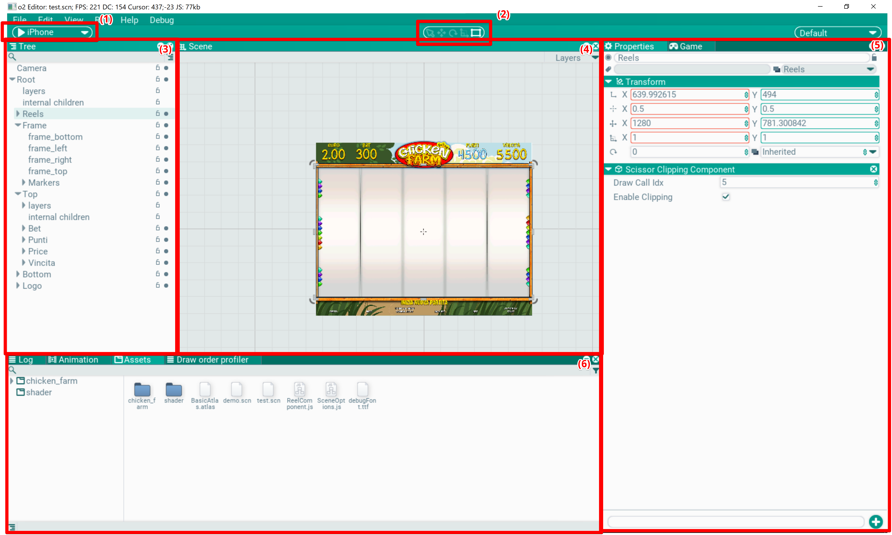

## Editor

The editor is where scenes are laid out and game content is created.

It contains internal windows that can be docked to each other and stacked into tabs. Windows can be moved, docked to other windows (drag by the window title) and grouped into tabs (double-click the title).

The editor works in two modes: editing and play. In edit mode the scene is loaded but does not receive updates, staying in a static state; it can be edited and saved. In play mode the scene can be tested: everything is shown in the editor, but the scene updates and input is processed in the game window. The scene cannot be saved in this mode.

Scene changes can be undone and redone: Edit/Undo (Ctrl+Z) and Edit/Redo (Ctrl+Y).

Windows and elements of the default layout:

- (1) scene launch panel. Pressing Play expands it, allowing to pause the game (F11) and step one frame (F10). On the right of the panel is the game speed control: "−"/"+" buttons with the current multiplier between them switch the scene update speed over the scale 0.1, 0.25, 0.5, 0.75, 1.0, 1.5, 2, 3, 5, 10 (only the game slows down or speeds up, the editor updates as usual). The same actions live in the Run menu: Play - stop (P), Frame step (Ctrl/Cmd+P), Speed up (Ctrl/Cmd+"+"), Slow down (Ctrl/Cmd+"−"). The device dropdown from the screenshot is outdated and removed — the emulated resolution is selected in the Game window.

- (2) tools panel. Selects the active tool, which switches the editing mode in the scene

- (3) [Tree](/Docs/en/Editor/Tree/tree.md). Scene hierarchy window. Shows actors and their children in the scene

- (4) [Scene](/Docs/en/Editor/Scene/scene.md). Scene editing window

- (5) [Properties](/Docs/en/Editor/Properties/properties.md). Settings window for the selected object

- (5) [Game](/Docs/en/Editor/Game/game.md). Game window, emulates graphics output and input handling as if the application ran standalone

- (6) [Assets](/Docs/en/Editor/Assets/assets.md). Assets window; assets can be moved, edited and browsed here

- (6) [Log](/Docs/en/Editor/Log/log.md). Log window, debug messages are printed here

- (6) [Animation](/Docs/en/Editor/Animation/animation.md). Animation editor; keys, parameters and curves are edited here

- [Pipeline](/Docs/en/Editor/Pipeline/pipeline.md). Node editor of AI content pipelines; opens on a pipeline asset and saves generated files into the assets folder. [Internals](/Docs/en/Editor/Pipeline/internals.md): graph, executor, nodes and providers

### Editor UI style
The look of the editor widgets is built by code (`EditorUIStyleBuilder`, `EditorUIStyle.cpp`) and cached as prototypes in `o2/Editor/Assets/Editor UI styles` (not in git). The editor loads the cache only when its built copy in `BuiltAssets/<platform>/EditorData` was generated from the current `EditorUIStyle.cpp`; otherwise it rebuilds the style in memory at startup (about 0.1 s) and refreshes the saved prototypes, which reach the built copy with the next build of the `Editor` target.

### Vector graphics of the editor UI
The editor draws its UI with vector images: every sprite `X.png` in `o2/Editor/Assets/ui` has a twin `X.svg` (`VectorImageAsset`, drawn by `VectorSprite` as plain triangles with per-vertex color, see [render](/Docs/en/Architecture/LowLevel/render.md)). The `.svg.meta` repeats `sliceBorder` and `defaultMode` of the `.png.meta`; the PNG files stay as the raster originals.

- Code creates drawables as `mmake<VectorSprite>("ui/X.svg")` and changes images through `WidgetLayer::SetImage`, `Widget::SetLayerImage`, `Button::SetIconImage`, never `mmake<Sprite>("ui/X.png")`. Raster stays where vector cannot work: textures built in code (checker, color picker, previews, render targets), `ui/pipeline/checker.png` (tiled) and `ui/UI4_animation_bar.png` (corner colors).
- Tools, `o2/Tools/VectorUI` (see its `README.md`): `ai_to_svg.py` converts the Illustrator source, `fit_check.py` measures every SVG against its PNG with the engine rasterizer, `import_svgs.py --src <dir>` copies the fitted SVGs next to the PNGs and writes `X.svg.meta` with a stable id derived from the path. PNG metas and ids are never changed.
- Tests.
  - `o2SystemTests/EditorVectorSprites` (headless, runs on CI): every `X.svg` is rasterized in software and compared with `X.png` over gray, white and black backgrounds (similarity >= 0.98 at tolerance 24, mean difference <= 3; a sprite below that has to be listed in the test with its own floor); image size and meta match the PNG; every `"ui/..."` path in the editor and framework sources resolves to an asset and uses the vector twin when there is one.
  - `o2EditorUITests/EditorVectorUIParity` (real window and GPU, excluded on CI): renders the same UI with vector graphics and with every vector sprite replaced by a `Sprite` of its PNG twin (the test swaps the drawables of the styles and the widget tree) in one process and requires >= 99% of equal pixels at tolerance 4. Scenes: the whole editor (menu, tools panel, docked windows in three tab layouts, a small scene with a selected actor, fixed log messages), dialogs and a context menu over it, and a gallery of every widget style in every state. Each pass rebuilds the style in memory and recreates all windows; states are settled with a fixed time step and the cursor is parked. The frames and their difference are saved to `build/o2/TestScreenshots/vector_parity/<scene>_raster.png`, `_vector.png`, `_diff.png`; the similarity at tolerances 0, 2, 4, 8, 16, 24 is printed.
- Known differences from raster: a sprite standing between pixels or drawn smaller than its image is blurred by texture filtering as raster and has exact edge coverage as vector (time line of the animation window, scroll bar handles, the 70 px `UI4_o2_sign` drawn at 18 px).
