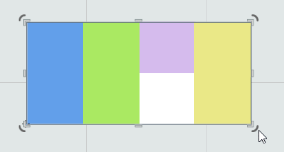

# Архитектура движка

Архитектура делится на три слоя:

- **верхний**: сцена, акторы, компоненты, UI, редактор
- **низкий**: обёртка приложения, ассеты, рендер, анимации, ввод, физика, скрипты, звуки
- **утилитарный**: рефлексия и сериализация, менеджмент памяти, файловая система, отладка и логгирование, математика, делегаты, проперти, контейнеры данных, таймеры

Входная точка — это обёртка приложения (`o2::Application`), которая предоставляет кроссплатформенное API для управления приложением. Она имеет платформенные реализации для Windows, macOS, Linux, iOS, Android, Emscripten (WIP). Часть низкоуровневых и утилитарных систем (рендер, файловая система, таймеры) также имеют платформенные реализации. Все подсистемы оформлены как синглтоны для удобного доступа к ним.

Перед запуском приложения статически инициализируются некоторые утилитарные системы (например, менеджмент памяти, рефлексия). Затем при старте создаётся экземпляр приложения, который инициализирует остальные подсистемы, и после этого запускается игровой цикл.

Игровой цикл состоит из двух фаз: обновление и отрисовка. Всё выполняется внутри o2::Application::ProcessFrame, где обновляются система ввода, сцена, физика, вызывается рендер и т. д.

Разработчик может переопределить логику o2::Application, унаследовав собственный класс и реализовав там необходимые функции: инициализацию, запуск, отрисовку, обновление, сворачивание и разворачивание приложения.

## Менеджмент памяти [(подробная документация)](/Docs/ru/Architecture/Utils/memory.md)

В движке используются собственные смарт-указатели, которые имеют внешний счётчик ссылок с внутренней ссылкой на него в самом объекте. Это даёт возможность преобразовывать обычный «сырой» указатель в умный, если объект унаследован от `RefCounterable`, хранящего в себе ссылку на счётчик. Для управления временем жизни используется сильная ссылка `Ref<>`, а для не влияющих на время жизни — слабая ссылка `WeakRef<>`. Объекты для умных указателей создаются только через функцию `mmake<T>(...)`, которая выделяет память под счётчик и объект одним блоком, чтобы счётчик всегда шёл перед объектом (cache-friendly). В режиме отладки в движке работает отладочный GC, указывающий на возможные утечки памяти и циклические ссылки, однако сам он объекты не уничтожает и служит лишь для анализа. В редакторе есть утилита для просмотра дерева памяти, где подсвечиваются проблемы. Кроме того, в движке предусмотрены специализированные ссылки для сериализации уникальных идентификаторов: `AssetRef` (для ассетов) и `LinkRef` (для акторов и компонентов).

<details>
<summary>Пример</summary>

```C++
class MyObject: public o2::RefCounterable 
{};

Ref<MyObject> myObjectSample = mmake<MyObject>(...);
myObjectSample->DoSmth();

WeakRef<MyObject> myWeakObject = WeakRef(myObjectSample);

MyObject* rawObject = myObjectSample.Get();
Ref<MyObject> myObjectSample2 = Ref(rawObject);
```
</details>

## Рефлексия [(подробная документация)](/Docs/ru/Architecture/Utils/reflection.md)

Используется для доступа к структуре типов в рантайме (поиск анимируемых значений по строковому пути, вызов коллбеков по имени, сериализация/десериализация, автоматические биндинги скриптов). В основе лежит метаинформация о типах, генерируемая утилитой **o2CodeTool**. Она парсит заголовочные файлы (`.h`), находит в них классы C++ и анализирует их структуру (включая наследование). Затем определяет наследников `IObject` и в конце `.h` генерирует метаинформацию о типе. Эта метаинформация сохраняется в общий репозиторий и формируется инкрементально: кодогенератор хранит кэш проанализированных файлов и обновляет только те, что были изменены.

<details>
<summary>Пример</summary>

```C++
struct MyObject: public o2::IObject 
{
    float value = 0.0f;

    float DoSmth(float arg);

    IOBJECT(MyObject);
};

MyObject myObjectSample;
auto& type = TypeOf(MyObject);

assert(myObjectSample.GetType() == type);

float floatValue = type.GetField("value").GetValue(&myObjectSample);
float funcResult = type.Invoke<float>("DoSmth", &myObjectSample, floatValue);
```
</details>

## Сериализация [(подробная документация)](/Docs/ru/Architecture/Utils/serialization.md)

Для внутреннего хранения данных используются форматы JSON и бинарный (в разработке). Данные представляются в виде `o2::DataValue` — структуры наподобие RapidJSON или PugiXML, позволяющей хранить массивы, таблицы или простые значения (числа, строки, логические и т. д.). Объект `o2::DataValue` может быть загружен из файла и преобразован в C++-объект, либо наоборот — объект сериализуется в `o2::DataValue` и сохраняется.

Сериализация осуществляется через рефлексию, а именно с помощью генерируемой метаинформации типов. В процессе сериализации специальный объект записывает данные в `o2::DataValue`. Для этого объект обязан унаследовать интерфейс `o2::ISerializable`, а поля, подлежащие сериализации, должны быть помечены атрибутом `@SERIALIZABLE`. Таким образом, сериализуются только необходимые типы и поля, включая примитивы, контейнеры и смарт-указатели.

<details>
<summary>Пример</summary>

```C++
class Reel : public ISerializable
{
public:
	LinkRef<Actor> imagesContainer; // @SERIALIZABLE

	Vector<AssetRef<ImageAsset>> images;        // @SERIALIZABLE
	Vector<AssetRef<ImageAsset>> blurredImages; // @SERIALIZABLE

	float imagesDistance = 100.0f; // @SERIALIZABLE

	bool disableExtendedSymbols = false; // @SERIALIZABLE

	SERIALIZABLE(Reel);
};
```
</details>

## Проперти [(подробная документация)](/Docs/ru/Architecture/Utils/properties.md)

Проперти позволяют объявлять переменные, которые используют сеттер и геттер «под капотом», упрощая код. Вместо `object.SetValue(object.GetValue() + 200.0f);` можно писать `object.value += 200.0f;`, аналогично механизму свойств из C#.

Чтобы объявить проперти в классе, сначала ставится макрос `PROPERTIES(class_name)`. Затем для каждой проперти используется макрос `PROPERTY(type, name, setter, getter)`, где `setter` и `getter` — функции класса, обрабатывающие чтение и запись значения.

<details>
<summary>Пример</summary>

```C++
class MyObject
{
public:
	PROPERTIES(MyObject);
    PROPERTY(float, value, SetValue, GetValue);

public:
    void SetValue(float value);
    float GetValue() const;
};

MyObject object;

object.value = object.value + 100.0f; // object.SetValue(object.GetValue() + 100.0f);
```
</details>

## Делегаты [(подробная документация)](/Docs/ru/Architecture/Utils/function.md)

`o2::Function<>` — это аналог `std::function<>` с расширенным функционалом, позволяющий хранить несколько делегатов одновременно. Такой подход упрощает систему подписок и событий в логике. Например, можно объявить в классе кнопки `o2::Function<void()> onClick;` и подписать на неё несколько обработчиков.

<details>
<summary>Пример</summary>

```C++
class MyButton
{
public:
	Function<void()> onClicked;

    ...
};

MyButton button;
button.onClicked += []() { ... };
button.onClicked += []() { ... };
button.onClicked += []() { ... };
```
</details>

## Обертка приложения [(подробная документация)](/Docs/ru/Architecture/LowLevel/application.md)

Как было описано выше это входная точка и основная система движка. На этапе инициализации она инициализирует другие подсистемы. Далее начинается игровой цикл, который обрабатывается в функции ProcessFrame(). Там вызывается апдейт сцены, инпута и всех остальных подсистем, а так же происходит рендер кадра. Так же в обертке приложения обрабатываются системные сообщения: активация и деактивация, и т.д.

Пользователь может вклиниться в любой их этих точек, перегрузив специальные функции в своем кастомном классе приложения

<details>
<summary>Пример</summary>

```C++
class MyApplication: public o2::Application
{
private:
    void OnUpdate(float dt) override;
    void OnDraw() override;
    void OnActivated() override;
    void OnDeactivated() override;
    void OnStarted() override;
    void OnClosing() override;
    void OnResizing() override;
};


```
</details>

## Ассеты [(подробная документация)](/Docs/ru/Architecture/LowLevel/assets.md)

Движок рассматривает ресурсы (текстуры, звуки, текстовые конфиги и т. д.) как ассеты, поступающие в сыром виде. Для быстроты загрузки в рантайме они предварительно собираются: текстуры упаковываются в атласы и сжимаются, звуки конвертируются, конфиги бинаризируются.

Каждый ассет имеет уникальный `id`, хранящийся в `.meta`-файле рядом с самим ассетом. В этом файле также может быть информация о сжатии и другие данные, которые нельзя разместить в исходном файле. Кроме того, создаётся дерево ассетов, позволяющее эффективно загружать их метаданные.

Процесс сборки ассетов осуществляет утилита **AssetsBuilder**, отслеживающая изменения ресурсов и обновляющая их собранные версии. Она запускается перед стартом редактора, во время его работы и при сборке финального билда.

Для работы с ассетами предусмотрена подсистема `o2::Assets` (синглтон), доступная из любого места в коде через макрос `o2Assets`. Она загружает дерево ассетов при старте и предоставляет к ним удобный интерфейс. Используются умные ссылки `o2::AssetRef<>`, которые сериализуются, кешируют загрузку и автоматически выгружают ассет, если на него нет активных ссылок.

Ассеты могут существовать как отдельные файлы или быть «встроенными» (instance). В последнем случае ассет сохраняется непосредственно внутри сцены или префаба.

<details>
<summary>Пример</summary>

```C++
AssetRef<ImageAsset> image = o2Assets.GetAssetRef(id);
sprite.Load(image);
```
</details>

## Рендер [(подробная документация)](/Docs/ru/Architecture/LowLevel/render.md)

Подсистема рендеринга доступна через синглтон `o2Render`. Она может рисовать треугольные меши с материалами (шейдеры, текстуры, параметры (WIP)) и использует батчинг: меши с одинаковыми материалами объединяются и отправляются на рендер одним вызовом. Поддерживается настройка отсечения, стенсил-маски и рендер-таргетов.

Сверху над рендером мешей есть абстракции: спрайт, текст, скиннинг-меши, эффекты частиц, Spine-анимации. Все они реализуют `o2::IDrawable`, а объекты с прямоугольными размерами — ещё и `o2::IRectDrawable`. Параметры `o2::IRectDrawable` включают позицию, размер, поворот, скейл, скос или задание трансформа через `o2::Basis`.

- **Спрайты** поддерживают режимы отображения: обычный, 9-slice, tiled, progress filled. Задают цвет и прозрачность, загружаются из текстур.
- **Текст** работает с растровыми и векторными шрифтами (через FreeType). Есть эффекты CPU (тень, обводка, градиент и т. д.), а также параметры форматирования и выравнивания.
- **Система частиц** представлена одиночными эмиттерами с набором эффектов. Рендер осуществляется как обычный спрайт или покадровая анимация. Поддерживаются стартовые параметры, а в редакторе можно отмотать эффект назад.

Так же в рендере есть поддержка камер (`o2::Camera`), задающие вьюпорт в логических координатах рендера.

<details>
<summary>Пример</summary>

```C++
AssetRef<ImageAsset> imageAsset = o2Assets.GetAssetRef(id);
auto sprite = mmake<Sprite>(imageAsset);
...
sprite->position = Vec2F(10, 10);
sprite->mode = SpriteMode::FixedAspect;
sprite->transparency = 0.5f;
...
sprite->Draw();
```
</details>

## Анимации [(подробная документация)](/Docs/ru/Architecture/LowLevel/animations.md)

В движке существует встроенная система анимаций и интеграция со Spine. Spine-анимации загружаются из ассета, умеют проигрываться, микшироваться и менять скины.

Встроенный формат тесно интегрирован в движок и позволяет анимировать любые поля (включая пользовательские). Основная единица — **`o2::AnimationClip`**, который может быть сохранён как ассет (`o2::AnimationAsset`). Клипы состоят из треков, где каждый трек анимирует одно поле, определяемое строковым путём (например, `"myStructure/myFolder/myParameter"`). Треки включают ключевые кадры с конкретным значением и временем.

Для проигрывания используется **`o2::AnimationPlayer`**: ему передаётся анимационный клип и целевой объект. По строковым путям рефлексия находит требуемые поля. При обновлении времени плеер интерполирует ключевые кадры в треках, обеспечивая плавность при любом фреймрейте.

На сцене доступен компонент **`o2::AnimationComponent`**, позволяющий одновременно проигрывать несколько анимаций на актёре и смешивать их по весам. Он хранит список состояний (клипов) и переключается между ними.

Сверху над ним существует **`o2::AnimationStateGraphComponent`** — анимационный граф состояний. Он содержит узлы (состояния) с несколькими анимационными клипами и переходы, задающие момент старта, длительность и easing-функцию. Разработчик указывает целевую ноду, а граф автоматически выстраивает путь, обрабатывая все переходы и блендинги. Эта система работает и со встроенными, и со Spine-анимациями.

В редакторе есть специальный редактор встроенных анимаций. [Подробнее](/Docs/ru/Editor/Animation/animation.md).
Так же анимации возможно конструировать из кода через интерфейс **`o2::Animate`**

<details>
<summary>Пример</summary>

```C++
sample->SetHighlightAnimation(Animate(*sample->GetHighlightDrawable()).
                                      Hide().Scale(1.5f).Then().
                                      Wait(0.3f).Then().
                                      Show().Scale(1.0f).For(0.2f).Then().
                                      Wait(1.0f).Then().
                                      Hide().For(0.2f));
```
</details>

## Обработка ввода [(подробная документация)](/Docs/ru/Architecture/LowLevel/input.md)

Система ввода доступна через синглтон `o2Events`. Она предоставляет базовые обработчики системных событий (нажатие кнопок, положение курсора и т. д.) и высокоуровневую логику (клики, мультитач). Высокоуровневая часть учитывает рендер-отсечение и перекрытие элементов.

Для реализации работы с тачем (кликами, наведением) следует наследоваться от `o2::CursorAreaEventsListener` и реализовать нужные методы (нажатие, отжатие, вход, выход и т. д.). Обязательны два метода:
1. Проверка условия клика (например, попадает ли курсор в границы объекта).
2. `OnDraw` — вызывается при отрисовке, чтобы зафиксировать порядок объектов и текущее рендер-отсечение.

Далее система ввода автоматически определяет, на какой объект пришёлся клик, и вызывает соответствующие колбэки.

<details>
<summary>Пример</summary>

```C++
class MyInteractiveObject: public o2::CursorAreaEventsListener
{
public:
    bool IsUnderPoint(const Vec2F& point) override { return _rectangle.IsInside(point); }

    void Draw()
    {
        sprite.Draw();

        o2::CursorAreaEventsListener::OnDrawn();
    }

private:
    void OnCursorPressed(const Input::Cursor& cursor) override { o2Debug.Log("Pressed!"); }
    void OnCursorReleased(const Input::Cursor& cursor) override { o2Debug.Log("Released!"); }
};
...
auto object = mmake<MyInteractiveObject>();
...
object.Draw();
```
</details>

## Скрипты [(подробная документация)](/Docs/ru/Architecture/LowLevel/scripting.md)

В движке используется **JerryScript** — компактный и производительный JavaScript-рантайм, который также позволяет писать код на TypeScript при желании иметь статическую типизацию.

Сверху JerryScript реализована движковая обёртка, доступная через синглтон `o2Scripts`, и враппер JavaScript-переменных `o2::ScriptValue`.  
- `o2Scripts` позволяет загружать и выполнять скрипты из файлов и строк, а также работать с глобальным пространством имён через `o2::ScriptValue`.  
- `o2::ScriptValue` отражает любую JS-переменную (число, строку, булевое, функцию, массив или объект) и предоставляет удобный интерфейс для взаимодействия с этими типами, а также с классами и прототипами.

Биндинг типов C++ выполняется за счёт механизма рефлексии: при запуске приложения движок регистрирует необходимые классы в глобальном пространстве рантайма JavaScript, используя сгенерированную метаинформацию.

<details>
<summary>Пример</summary>

```C++
o2Scripts.GetGlobal().SetProperty("myValue", 256);
o2Scripts.Eval("print('myValue is ' + myValue)");
...
o2Scripts.Eval("let myObject = new MyObject");
auto myJSObject = o2Scripts.GetGlobal().GetProperty("myObject");
auto myProperty = myJSObject["propName"];
if (myProperty.GetValueType() == o2::ScriptValue::ValueType::Number)
{
    float myPropertyValue = myProperty.ToNumber();
    ...
}
```
</details>

## Физика [(подробная документация)](/Docs/ru/Architecture/LowLevel/physics.md)

В o2 встроен физический движок Box2D. При старте приложения инициализируется физический мир, в который можно добавлять объекты через примитивы сцены. Для игрового мира можно настраивать масштабирование движковой единицы пространства в мир физики, параметры точности солвера и коллизии между слоями.

Базовый примитив на сцене — это `o2::RigidBody`. В нём задаются физические параметры тела, и оно интегрируется в физический мир. К нему могут быть прикреплены коллайдеры — `o2::ICollider`, такие как `BoxCollider`, `CircleCollider` и т. п.

Работа и настройка физики происходит через сцену и редактор.

## Звукци (TBD)

На текущий момент не реализованы в движке

## Сцена и акторы [(подробная документация)](/Docs/ru/Architecture/HighLevel/scene.md)

Над всеми подсистемами работает система сцены, доступная через синглтон `o2Scene`. В ней хранится список акторов (`o2::Actor`), имеющих свои компоненты, определяющие логику и отрисовку. Акторы могут относиться к разным типам, например `o2::Widget` (UI), `o2::RigidBody` (физическое тело) и другие пользовательские классы.

Сцену можно сохранять и загружать из ассета, включая инкрементальную загрузку. Логически она существует в единственном экземпляре (по крайней мере, на данный момент). Сама сцена обновляется и рендерится автоматически.

### Акторы

Каждый актор (`o2::Actor`) имеет трансформацию, флаги видимости и активности, а также содержит дочерних акторов и компоненты. Дочерние акторы наследуют трансформацию родителя и его флаги. Если родительский актор сдвигается, то все потомки тоже смещаются по иерархии. То же самое происходит при отключении или включении акторов.

В движке уже есть набор базовых типов: спрайты, анимации, камеры, частицы, UI и т. д. Разработчик может унаследовать собственные классы от `o2::Actor` и переопределить необходимые методы (`OnStart`, `OnEnabled/Disabled`, `OnDraw`, `OnUpdate` и т. п.). Это позволяет трактовать акторы как конкретные сущности с определёнными целями (например, `o2::Button` наследуется от `o2::Widget`, что в свою очередь является потомком `o2::Actor`).

### Компоненты

Акторы могут содержать список компонентов, определяющих их логику и отрисовку. Для создания пользовательской компоненты нужно унаследовать её от `o2::Component` и реализовать нужный функционал (`OnStart`, `OnEnabled/Disabled`, `OnDraw`, `OnUpdate` и т. д.). Такой подход позволяет реализовывать логику по принципу композиции: один базовый актор может включать несколько компонентов.

### Прототипы

Для ускорения и упрощения разработки используется механизм прототипов — аналогичный префабам в Unity3D. Актор может быть сохранён в ассет, становясь прототипом, от которого можно наследовать другие прототипы, внося изменения относительно базового. Из прототипа легко создать множество копий на сцене, а затем при необходимости модифицировать их.

Такой механизм особенно полезен в UI. Можно создать базовый прототип кнопки, настроить её графику и логику, а затем сделать несколько наследованных прототипов (зелёная, синяя, красная). Если нужно изменить, к примеру, цвет синей кнопки на фиолетовый, это делается в одном месте — в самом прототипе. А изменения в базовом прототипе распространятся на все места, где он используется.

### Отрисовка сцены

Рендер сцены осуществляется с помощью камер и слоёв:
- Сцена делится на именованные слои, которым задаётся порядок отрисовки.
- На сцену помещаются камеры (как минимум одна), каждая из которых имеет свою трансформацию и список слоёв для рендеринга.

Акторы привязываются к слоям и имеют числовой приоритет. Он задаётся в самом акторе. При желании приоритет и слой можно наследовать от родителя, тогда дочерние акторы рисуются сразу после родителя, поддерживая его слой и приоритет. Если наследование не включено, они выводятся отдельно на своём слое согласно сортировке. Таким образом, по умолчанию иерархия определяет порядок отрисовки, но при необходимости можно вручную влиять на это при помощи приоритетов и слоёв.

### Редактор

Для редактирования сцены, прототипов, компонентов и ассетов существует встроенный редактор, включающий ряд специализированных утилит (настройка ассетов, лог, окно параметров, окно игры, иерархия сцены, редактор самой сцены и анимаций). [Подробнее о редакторе](/Docs/ru/Editor/editor.md).

## UI [(подробная документация)](/Docs/ru/Architecture/HighLevel/ui.md)

Интерфейсы в движке являются частью сцены и основаны на её парадигме. Базовым элементом UI служит `o2::Widget` (наследник `o2::Actor`), который переопределяет логику актора:

- **Адаптивная верстка:** В трансформацию добавляются якоря, позволяющие гибко привязывать виджет к родителю для построения адаптивного интерфейса.


- **Внутренние виджеты:** Внутри виджета могут находиться дочерние контролы, не являющиеся полноправными «детьми» в общей иерархии, что удобно для комплексных UI-элементов (например, окно с хедером и кнопкой закрытия).
- **Система слоёв:** Виджет содержит слои (`o2::WidgetLayer`), которые имеют собственную графику (спрайт, текст и т. д.), трансформацию с якорями, иерархию вложенных слоёв и имена. Слои представляют упрощённый аналог акторов, облегчающий отрисовку и не загромождающий иерархию сцены.
- **Анимационные состояния:** У виджета есть набор независимых состояний (по имени), каждое из которых может включаться/выключаться. При переключении состояния проигрывается анимация, заданная в коде или в редакторе (см. раздел анимаций).

### Layout-контейнеры
Для создания адаптивного интерфейса используются специальные виджеты-контейнеры (`o2::HorizontalLayout`, `o2::VerticalLayout`, `o2::GridLayout`). Они упорядочивают дочерние элементы согласно заданным правилам, растягивая/сжимая их или подстраиваясь под размеры.



### Набор готовых виджетов
В движке есть множество базовых UI-контролов: картинка, текст, кнопка, чекбокс, текстовое поле, прогресс-бары, скроллеры, списки (обычные и выпадающие), дерево, попап, окно и т. д.

Поскольку UI-подсистема — это расширение системы сцены, её элементы могут сочетаться с любыми игровыми объектами. Собственно, весь редактор o2 построен на этой системе UI ([подробнее в статье на Habr](https://habr.com/ru/articles/521306/)).