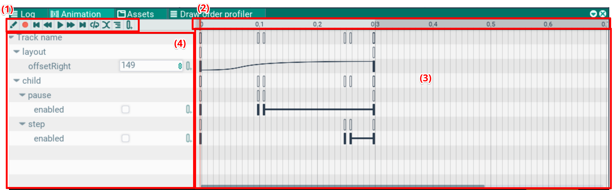
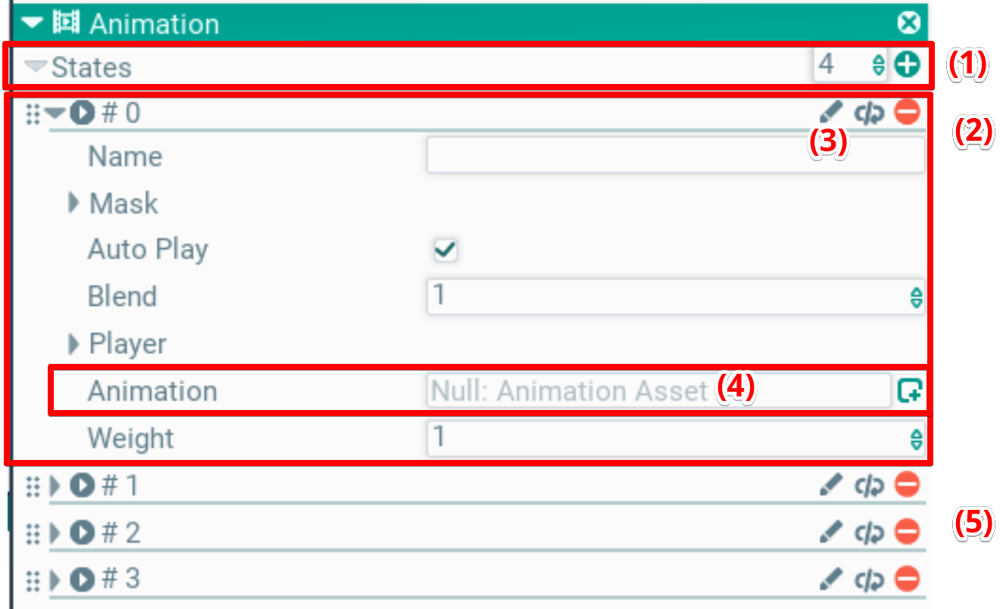

## Animation. Окно анимации

В этом окне редактируется ассет анимаций. Функционал аналогичен другим редакторам анимаций, например Spine.

В окне есть тулбар с типичным для таких редакторов функционалом: запись, перемотка, плей/стоп, зацикливание, режим кривых, список параметров и добавление ключа.

Слева в окне отображен список параметров, повторяющих иерархию на сцене (4). Справа включи на таймлайне (3). Сверху от таймлайна управление временем анимации (2). Пока состояние `AnimationComponent` открыто на превью, окно ведёт актор своим плеером: миксеры компонента для треков этого состояния не применяются, скраббинг курсора не перебивается значениями состояния. Кадры частиц саб-треков запекаются при скраббинге покадрово: для каждого кадра value-треки клипа вычисляются на его время, так что эмиттер стоит там, где клип ставит актор в этот момент — world-space частицы остаются вдоль пути, relative едут с актором. Если запечённый кадр не совпадает с текущим трансформом (правка траектории), кэш пересчитывается заново с тем же зерном — рисунок частиц не меняется. Правка параметров и эффектов эмиттера саб-трека сразу перезапекает кадр на текущей позиции курсора — даже если у эмиттера остался флаг «играет» (play в заголовке компонента): саб-контролируемый эмиттер сам не обновляется, и этот флаг не учитывается.

### Компонента анимации
Чтобы добавить анимацию на актор, нужно добавить компоненту Animation через меню добавления компонент.

В этом компоненте задается список анимаций (1), которые могут проигрываться одновременно. 

Если в нескольких анимациях анимируются одни и те же параметры, то вычисляется среднее, в зависимости от веса (Weight). Таким образом можно смешивать несколько анимаций и делать плавные переходы между ними.

В каждой анимации задается ссылка ассет на анимацию (4). Ее можно выбрать из готового ассета, или создать ассет inplace.

Чтобя отредактировать анимацию, можно нажать иконку карандаша (3) на заголовке анимации 

### Параметры анимации
Чтобы заанимировать какой-то параметр, нужно добавить его в анимацию. Для этого нужно кликнуть кнопку с полосками, откроется окно доступных параметров.

В этом списке с помощью кнопок (+) и (-) можно добавлять или удалять анимируемые параметры. Анимировать можно все, что отображается в окне настроек Properties.

### Ключ и параметры
\
Для каждого параметра выводится поле редактирования слева. На таймлайне столбиками отмечены ключи, в которых параметр явно задан. Между ключами происходит интерполяция, в зависимости от настройки кривой

### Настройка кривых

По клику на указанную на скриншоте кнопку в тулбаре, таймлайн перезодит в режим кривых.

В нем отображаются кривые для числовых параметров. Они представляют из себя кривые безье, и редактируются как в аналогичных редакторах с помощью мышки.

Зум и скролл делается как в сцене, правой кнопкой мыши и колесиком.