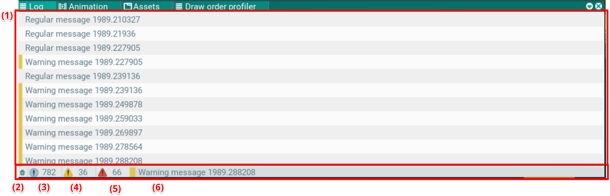

## Log. Окно логов

В этом окне отображаются логи, выведенные через систему отладки движка. Логи разделены по важности:
- обычные
- предупреждения (желтый)
- ошибки (красный)

И выведены списком в порядке их появления (1). Пока список прокручен до конца, он следует за новыми сообщениями; прокрученный вверх - остаётся на месте. Сообщения из других потоков появляются в следующем кадре.

Логи можно очистить (2), отключить отображение по важности (3) (4) (5).

В строке снизу показано последнее сообщение лога (6).