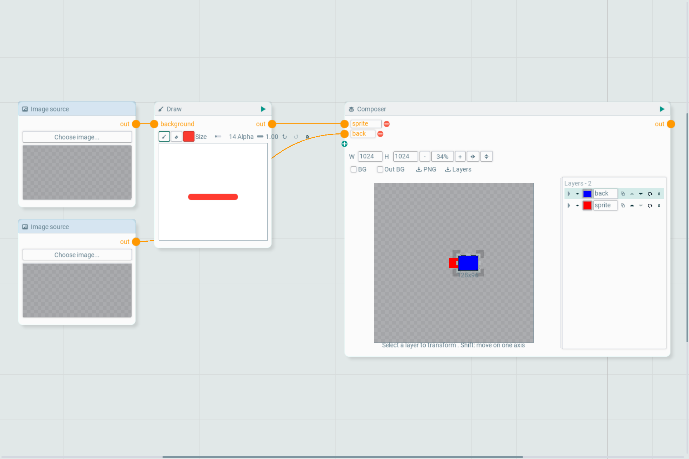

## Pipeline. Окно AI-пайплайнов

Редактирует ассет `.pipeline`: граф нод, который превращает текст, картинки и звуки в игровые ассеты с помощью AI-провайдеров и локальной обработки. Открывается из окна ассетов (двойной клик по ассету пайплайна, `Create/Pipeline` в контекстном меню создаёт новый) или через `View/Show Pipeline`.

Окно - это холст с карточками нод. Панель инструментов запускает весь граф, останавливает выполнение, вписывает граф в окно и открывает диалог ключей провайдеров (Gemini, ElevenLabs, Kling; хранятся в `Work/Pipelines/PipelineSettings.json`). Строка статуса показывает лог исполнителя.

### Холст
- Правая кнопка и колесо двигают и масштабируют вид (вплоть до 1/40 натурального размера - хватает на графы из нескольких сотен нод), `F` вписывает граф, камера сохраняется в ассет.
- Обновляются и рисуются только карточки и связи внутри вида; при отдалении дальше примерно 1/3 карточки перестают рисовать контролы (поля, кнопки, ползунки, тулбары, рукоятки размера), а результат ноды - превью, рисунки, сцена композера - остаётся на месте, поэтому большой граф двигается плавно.
- Правый клик по пустому месту открывает `Add/<категория>` со всеми типами нод (у каждого пункта иконка ноды), а также `Paste` и `Select all`. Если утащить связь в пустое место, откроется то же меню, отфильтрованное по совместимым портам, и новая нода будет сразу подключена.
- Связи рисуются кривыми в цвете типа порта (текст - синий, картинка - оранжевый, видео - фиолетовый, звук - бирюзовый). Двойной клик по связи добавляет точку изгиба, точки перетаскиваются, `Straighten` в меню связи убирает их.
- Связь тянется от выходного порта к входному; перетаскивание от подключённого входа отсоединяет её и позволяет перекинуть. Порты с `+` принимают дополнительные входы (слои композера, референсы AI): бросьте связь на `+`, чтобы добавить вход, переименуйте его на месте, удалите через `-`.
- Карточки двигаются за заголовок и меняют размер за любой край или угол; карточка не бывает ниже своего содержимого. Рамка выделения, `Ctrl+C/V/D`, `Delete`, `Ctrl+A`, `Ctrl+Z/Y` работают как в редакторе сцены; каждое изменение - действие отмены окна.
- Рамка карточки показывает состояние ноды: бирюзовая - выбрана, синяя - выполняется или в очереди, зелёная - результат актуален, красная - ошибка (кнопка с восклицательным знаком показывает текст). Жёлтый бейдж считает повторы запросов к провайдеру.

### Импорт из AssetsLine
Кнопка импорта в тулбаре окна читает пайплайн, экспортированный из AssetsLine: обычный JSON пайплайна или бандл, сделанный командой «Экспорт с результатами…» (ZIP с `pipeline.json`, `manifest.json` и результатами в `results/`; старые JSON-бандлы тоже читаются). Типы нод, конфиги, порты и связи совпадают с обеих сторон, поэтому граф импортируется как есть; результаты из бандла становятся превью нод и отметками актуальности нового ассета (`Pipelines/<имя>.pipeline`), так что смотреть их можно без перезапуска. Рисунки draw-нод при импорте сохраняют свой размер в пикселях.

Результаты и кеш привязаны к id, который хранится в самом графе (`Work/Pipelines/cache/<id>/`), а не к ассету: сохранение пайплайна под другим именем или дублирование ассета сохраняет его результаты. Ассеты, сохранённые до появления id, при первом открытии берут UID ассета.

### Ноды
Источники (текст, картинка, звук), текстовые инструменты (шаблон, склейка), AI-ноды (текст, генератор промпта, генерация и правка картинки, вырезание спрайта, удаление фона, видео, звуковые эффекты, речь, музыка), эффекты картинок (рисование, обводка, тень, градиент, цвет, композер), обработка звука и финишные ноды. Тулбары, не помещающиеся в ширину карточки, переносятся на следующую строку (инструменты рисования, панель композера). В карточках те же элементы, что и в нодах AssetsLine: выпадающие списки моделей с пресетами, промпты, наследование seed, прозрачный фон (двойной проход белый/чёрный или хромакей с цветом, допуском, мягкостью и подавлением ореола) и превью результата с рамкой обрезки.

- **Draw** рисует штрихи поверх необязательной фоновой картинки: кисть и ластик, палитра и пикер цвета, слайдеры размера и прозрачности, отмена/повтор/очистка. Штрихи хранятся в конфиге ноды и накладываются на фон самой нодой.
- **AI image edit** содержит тот же редактор за `Draw over the image`; **AI extract sprite** добавляет инструмент области, рамка которой уходит в модель.
- **Composer** раскладывает несколько входных картинок на рабочей области фиксированного размера: слой выбирается на сцене, двигается, масштабируется и вращается рукоятками рамки (`Shift` двигает по одной оси); панель слоёв перечисляет их от верхнего к нижнему с видимостью, переименованием, дублированием, порядком, сбросом и удалением, а настройки слоя содержат размер с блокировкой пропорций, прозрачность и 9-slice с отступами и масштабом углов. `BG` показывает предпросмотр на цвете, `Out BG` заливает фон результата, `PNG` и `Layers` экспортируют результат и каждый слой.
- **Результаты со звуком и видео** проигрываются прямо в карточке: play/pause, ползунок перемотки, прошедшее и общее время, переключатель повтора и ползунок громкости. Звук идёт через звуковую систему движка; кадры видео и звуковая дорожка извлекаются ffmpeg при первом показе в `Work/Pipelines/cache/<pipeline>/video/<hash>/` (атлас кадров и WAV) и дальше берутся оттуда.
- **Finish** выбирают папку внутри `Assets` (ввод или список папок за `…`) и имя файла; карточка показывает полный путь, куда пишет нода, существует ли уже файл и размер входящего результата (с целевым размером, если включён ресайз), а кнопка с прицелом выделяет сохранённый ассет в окне ассетов. `Save to Assets` или запуск записывают файл, после чего редактор пересобирает ассеты, и файл сразу доступен в сценах.

Локальные ноды (текстовые инструменты, эффекты, рисование, композер, финиш) перезапускаются автоматически после изменения, если результаты выше по графу закешированы; ноды провайдеров запускаются кнопкой play или `Run all`. Результаты кешируются по сигнатуре содержимого, которая учитывает конфиг ноды и всех нод выше по графу, поэтому неизменённые ноды не запрашиваются повторно; `Clear result` в меню ноды сбрасывает кеш одной ноды.
