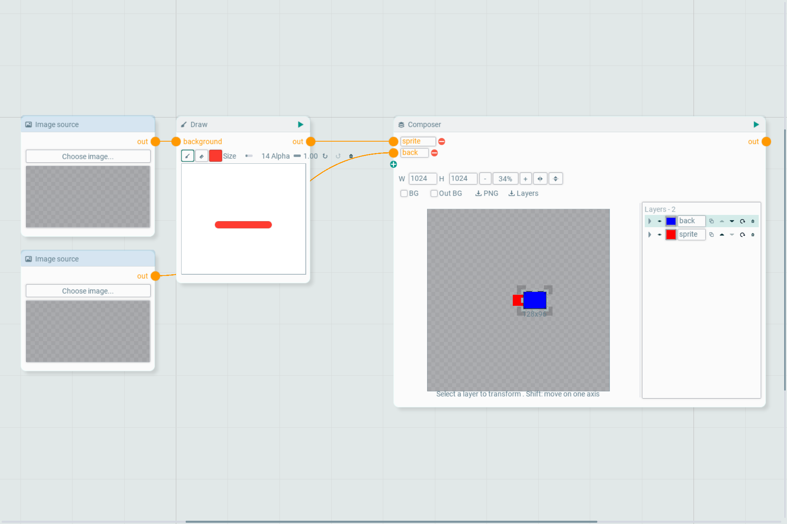

## Pipeline. Окно AI-пайплайнов

Редактирует ассет `.pipeline`: граф нод, который превращает текст, картинки и звуки в игровые ассеты с помощью AI-провайдеров и локальной обработки. Открывается из окна ассетов (двойной клик по ассету пайплайна, `Create/Pipeline` в контекстном меню создаёт новый) или через `View/Show Pipeline`. Файл - это документ пайплайна AssetsLine (JSON), тот же, что хранит веб-редактор AssetsLine, поэтому пайплайн переходит между ними без изменений.

Окно - это холст с карточками нод. Панель инструментов запускает весь граф (каждый конец ветки, поэтому цепочка, которую не забирает ни одна финишная нода, тоже выполняется), останавливает выполнение, вписывает граф в окно и импортирует файл AssetsLine; справа `Save all` записывает в ассеты то, что показывают все финишные ноды и композеры (из результатов на экране, ничего не генерируя), а шестерёнка открывает окно настроек: связь с AssetsLine и ключи провайдеров (Gemini, ElevenLabs, Kling; хранятся в `Work/Pipelines/PipelineSettings.json`). Строка статуса показывает лог исполнителя.

### Холст
- Правая кнопка и колесо двигают и масштабируют вид (вплоть до 1/40 натурального размера - хватает на графы из нескольких сотен нод - и не крупнее 4 натуральных); колесо масштабирует, а правая кнопка двигает вид и над карточками с их контролами; шаг зума берёт направление и величину дельты, но не падает ниже заметного минимума, поэтому вид одинаково слушается и колеса, и трекпада; правый клик без сдвига открывает меню карточки, связи или холста под курсором. Вид перерисовывает содержимое только когда есть что менять, но в системе курсора регистрируется каждый кадр - иначе простоявший вид перестал бы принимать мышь. `F` вписывает граф, камера сохраняется в ассет; масштаб из ассета прижимается к диапазону вида, а граф с нейтральной камерой (позиция в нуле, масштаб 1) редактор вписывает сам при открытии.
- Обновляются и рисуются только карточки и связи внутри вида; при отдалении дальше примерно 1/4 карточки перестают рисовать контролы (поля, кнопки, ползунки, тулбары, рукоятки размера), а результат ноды - превью, рисунки, сцена композера - остаётся на месте, поэтому большой граф двигается плавно.
- Правый клик по пустому месту открывает `Add/<категория>` со всеми типами нод (у каждого пункта иконка ноды), а также `Paste` и `Select all`. Если утащить связь в пустое место, откроется то же меню, отфильтрованное по совместимым портам, и новая нода будет сразу подключена.
- Порты помечены не только цветом, но и формой: круг - текст, квадрат - картинка, ромб - звук, треугольник - видео, поэтому связь читается и с приглушёнными цветами. Связи рисуются тонкими кривыми в цвете типа порта (текст - синий, картинка - оранжевый, видео - фиолетовый, звук - бирюзовый); их толщина следует за зумом, но не становится меньше одного пикселя. Двойной клик по связи добавляет точку изгиба, точки перетаскиваются, `Straighten` в меню связи убирает их.
- Связь тянется от выходного порта к входному; перетаскивание от подключённого входа отсоединяет её и позволяет перекинуть. Порты с `+` принимают дополнительные входы (слои композера, референсы AI): бросьте связь на `+`, чтобы добавить вход, переименуйте его на месте, удалите через `-`.
- Сетка холста совпадает с шагом прилипания: линия каждые 20 единиц и более яркая каждые 100; при отдалении мелкие линии гаснут, и сетка укрупняется в пять раз (100, 500, ...). Карточки двигаются за заголовок и встают на узлы сетки (остальные выделенные сохраняют расстояние до неё), размер меняется за любой край или угол; карточка не бывает ниже своего содержимого. Рамка выделения, `Ctrl+C/V/D`, `Delete`, `Ctrl+A`, `Ctrl+Z/Y` работают как в редакторе сцены; каждое изменение - действие отмены окна.
- Точка перед кнопкой play показывает состояние результата: зелёная - актуален для текущих входов, янтарная - результат есть, но входы изменились, пустая - ещё ничего не считалось, бирюзовая - выполняется. Обводка карточки отвечает за выделение (бирюзовая), выполнение или очередь (синяя) и ошибку (красная, кнопка с восклицательным знаком показывает текст); обводки следуют за зумом, но не тоньше одного пикселя. Жёлтый бейдж считает повторы запросов к провайдеру. У источников и самоприменяющихся нод нет ни play, ни точки.

### Импорт из AssetsLine
Кнопка импорта в тулбаре окна читает пайплайн, экспортированный из AssetsLine: обычный JSON пайплайна или бандл, сделанный командой «Экспорт с результатами…» (ZIP с `pipeline.json`, `manifest.json` и результатами в `results/`; старые JSON-бандлы тоже читаются). Типы нод, конфиги, порты и связи совпадают с обеих сторон, поэтому граф импортируется как есть; результаты из бандла становятся превью нод и отметками актуальности нового ассета (`Pipelines/<имя>.pipeline`), так что смотреть их можно без перезапуска. Более новый бандл несёт ещё и части попортовых нод - каждая восстанавливается как отдельный результат части - и файлы, которые читают ноды-источники: они пишутся в папку загрузок, поэтому импортированные источники не пустые. Рисунки draw-нод при импорте сохраняют свой размер в пикселях. Если в открытом пайплайне есть несохранённые изменения, импорт один раз спрашивает, сохранить ли их; при любом ответе открывается импортированный пайплайн.

Результаты и кеш привязаны к id, который хранится в самом графе (`Work/Pipelines/cache/<id>/`), а не к ассету: сохранение пайплайна под другим именем или дублирование ассета сохраняет его результаты. Ассеты, сохранённые до появления id, при первом открытии берут UID ассета.

### Синхронизация с AssetsLine
Проект можно связать с проектом AssetsLine (`Edit/Project/AssetsLine` или шестерёнка справа в заголовке окна). Точка на шестерёнке показывает состояние связи (пока синхронизация выключена, её нет): красная - нет связи (не подключено, офлайн, ошибка), синяя пульсирующая - идёт подключение, зелёная - подключено, зелёная пульсирующая - идёт синхронизация в ту или иную сторону. Тогда пайплайны одной папки `Assets` (по умолчанию `Pipelines`) и проекта AssetsLine - один набор: пайплайн, созданный или изменённый с любой стороны, появляется на другой, как и результаты - сгенерированное одной стороной доступно и актуально на другой без повторной генерации.
- Диалог показывает состояние в шапке (та же точка, состояние и что и когда синхронизировано или что пошло не так). Пока проект не связан, он спрашивает сервер и способ подключения: **Browser** открывает страницу AssetsLine, где выбирается проект, и на время ожидания показывает код и адрес страницы; **Access token** принимает токен, созданный в настройках AssetsLine (Settings → Connected editors). После связи показывает проект и аккаунт с кнопкой **Disconnect**. Токен хранится у пользователя в `Work/Pipelines/sync/`, связь (сервер, проект, папка, опции) - в настройках проекта.
- Синхронизируемый пайплайн сам сохраняется через секунду после правки, как автосохранение веб-редактора. Правки с двух сторон сливаются по нодам; если обе стороны поменяли одно поле, побеждает более позднее сохранение. Несохранённый пайплайн никогда не перезаписывается: удалённые изменения ждут сохранения и тогда сливаются.
- Переименования и удаления идут в обе стороны; пайплайн, удалённый на одной стороне и изменённый на другой, возвращается.
- **Write results of finish nodes into the assets**: результат, пришедший из AssetsLine в финишную ноду, записывается туда, куда пишет нода (`assetPath` или `Generated/<имя скачивания>` для пайплайна из веба).
- Источники из ассетов проекта выгружаются под id, вычисленным по содержимому, поэтому изменённый ассет - это изменённый источник и на другой стороне.
- Синхронизация работает на macOS и в веб-редакторе; у сокетного HTTP-бэкенда Windows и Linux нет https.

### Ноды
Источники (текст, картинка, звук), текстовые инструменты (шаблон, склейка), AI-ноды (текст, генератор промпта, генерация и правка картинки, вырезание спрайта, удаление фона (локально и моделью), видео, звуковые эффекты, речь, музыка), эффекты картинок (рисование, обводка, тень, градиент, цвет, композер), обработка звука и финишные ноды. Тулбары, не помещающиеся в ширину карточки, переносятся на следующую строку (инструменты рисования, панель композера). В карточках те же элементы, что и в нодах AssetsLine: выпадающие списки моделей с пресетами, промпты, наследование seed, прозрачный фон (двойной проход белый/чёрный или хромакей с цветом, допуском, мягкостью и подавлением ореола) и превью результата с рамкой обрезки.

Все карточки устроены одинаково, результат первым: сверху то, что нода произвела (у финишной - то, что к ней приходит), затем единственное поле, которое правят под каждый запуск (промпт, инструкция, подсказка), потом кнопки действий и в конце свёрнутая строка `Parameters · …` с перечнем скрытого - модель, seed, прозрачность, формат кадра и подобное; клик по строке плавно раскрывает их (карточка растёт на их высоту, стрелка поворачивается), повторный клик так же плавно сворачивает (свёрнутость запоминается для ноды и не влияет на кеш). Локальные ноды, чьи контролы и есть их работа - эффекты картинок и обработка звука - держат их открытыми под результатом.

- **Draw** рисует штрихи поверх необязательной фоновой картинки: кисть и ластик, палитра и пикер цвета, слайдеры размера и прозрачности, отмена/повтор/очистка. Штрихи хранятся в конфиге ноды и накладываются на фон самой нодой.
- **AI image edit** содержит тот же редактор за `Draw over the image`; **AI remove background** оставляет объект как есть, а всё вокруг закрашивает плоским фоном, который затем вырезается хромакеем или матированием.
- **AI extract sprite** вырезает из одной картинки несколько частей: сетка сверху отводит каждой части ячейку с её результатом, именем под ней (у выбранной части имя правится на месте) и в углу кнопкой перегенерации, которая перезапускает только эту часть, и кнопкой удаления; когда частей несколько, выходной порт каждой стоит в правом нижнем углу её ячейки, и связь выходит из того результата, который несёт. Клик по ячейке выбирает часть; исходник ниже показывает рамки всех частей с номерами, у выбранной - рукоятки инструмента области и кнопка удаления в углу (часть вне рамки затемнена), клик по другой рамке выбирает ту часть. `+ Add part` добавляет часть, а `Auto split` просит модель перечислить части картинки и заполняет сетку их рамками. Каждая часть - отдельный выходной порт с её именем, поэтому связи переживают переименование; каждая часть запускается, кешируется и показывается сама по себе, так что правка или перезапуск одной части не трогает остальные.
- Нода показывает то, что приходит ей на вход, ещё до запуска: ноды-источники (текст, картинка, звук) получают значение из конфига сразу, а карточка обновляется, как только к ней подключают или отключают связь.
- Списки моделей показывают названия продуктов (`Gemini 3.1 Flash Image · Nano Banana 2`, `Google Veo 3.1`, …, те же, что в AssetsLine); в конфиге хранится id модели.
- **Composer** раскладывает несколько входных картинок на рабочей области фиксированного размера: слой выбирается на сцене, двигается, масштабируется и вращается рукоятками рамки (`Shift` двигает по одной оси); панель слоёв перечисляет их от верхнего к нижнему с видимостью, переименованием, дублированием, порядком, сбросом и удалением, а настройки слоя содержат размер с блокировкой пропорций, прозрачность и 9-slice с отступами и масштабом углов. `BG` показывает предпросмотр на цвете, `Out BG` заливает фон результата. `Save layers to Assets` записывает каждый слой отдельным PNG-ассетом в выбранную папку с префиксом имени, как финишная нода пишет свой результат; сама композиция сохраняется через финишную ноду.
- **Результаты со звуком и видео** проигрываются прямо в карточке: play/pause, ползунок перемотки, прошедшее и общее время, переключатель повтора и ползунок громкости. Звук идёт через звуковую систему движка; кадры видео и звуковая дорожка извлекаются ffmpeg при первом показе в `Work/Pipelines/cache/<pipeline>/video/<hash>/` (атлас кадров и WAV) и дальше берутся оттуда.
- **Finish** показывают то, что к ним приходит, ещё до запуска и не имеют своей кнопки play. Они выбирают папку внутри `Assets` (ввод или список папок за `…`) и имя файла; карточка показывает полный путь, куда пишет нода, существует ли уже файл и размер входящего результата (с целевым размером, если включён ресайз). Поля ресайза показывают размер, с которым картинка сохранится (после обрезки); включение `Resize` или ввод размера начинают с него, а кнопка-звено между полями сохраняет пропорции, а кнопка с прицелом выделяет сохранённый ассет в окне ассетов. `Save to Assets` на карточке или `Run all` записывают файл, после чего редактор пересобирает ассеты, и файл сразу доступен в сценах.

Локальные ноды (текстовые инструменты, эффекты, рисование, композер, финиш) перезапускаются автоматически после изменения, беря последний отрисованный результат ноды-провайдера выше по графу даже без записи в кеше; ноды провайдеров запускаются кнопкой play или `Run all`. Результаты кешируются по сигнатуре содержимого, которая учитывает конфиг ноды и всех нод выше по графу, поэтому неизменённые ноды не запрашиваются повторно; `Clear result` в меню ноды сбрасывает кеш одной ноды.
